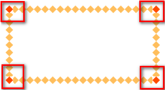

#
CSS3 学习笔记

 
##
目录
			
###第1章 CSS3简介	
	1.1	CSS3的现状	
	1.2	如何对待	
###第2章 准备工作	
	2.1	统一环境	
	2.1	如何使用手册	
###第3章 基础知识	
	3.1	选择器	
		3.1.1	属性选择器	
		3.1.2	伪类选择器	
		3.1.3	伪元素选择器	
	3.2	颜色	
	3.3	文本	
	3.4	边框	
		3.4.1	边框圆角	
		3.4.2	边框图片	
		3.4.3	边框阴影	
	3.5	盒模型	
	3.6	背景	
	3.7	渐变	
		3.7.1	线性渐变	
		3.7.2	径向渐变	
	3.8	2D转换	
	3.9	过渡	
	3.10	3D转换	
	3.11	动画	
	3.12	伸缩布局	
	3.13	多列布局	
###第4章 Web字体	
	4.1	字体格式	
	4.2	字体图标	
###第5章 兼容性	
###第6章 高级应用	
 

 
 

##第1章CSS3简介
	如同人类的的进化一样，CSS3是CSS2的“进化”版本，在CSS2基础上，增强或新增了许多特性， 弥补了CSS2的众多不足之处，使得Web开发变得更为高效和便捷。
###1.1CSS3的现状
	1、浏览器支持程度差，需要添加私有前缀

	2、移动端支持优于PC端

	3、不断改进中

	4、应用相对广泛
###1.2如何对待
	1、坚持渐进增强原则

	2、考虑用户群体

	3、遵照产品的方案

	4、听Boss的
##第2章准备工作
###2.1统一环境
>由于CSS3兼容性问题的普遍存在，为了避免因兼容性带来的干扰，我们约定统一的环境，以保证学习的效率，在最后会单独说明兼容性的问题。
	
	1、Chrome浏览器 version 46+

	2、Firefox浏览器 firefox 42+

	3、PhotoShop CS6（建议）
###2.2如何使用手册
>学会使用工具，可以让我们事半功倍。

	[]		表示全部可选项
	||		表示或者
	|		表示多选一
	？	表示0个或者1个
	*		表示0个或者多个
	{}		表示范围
>学会查看手册，培养自主学习能力。

##第3章基础知识
###3.1选择器
>CSS3新增了许多灵活查找元素的方法，极大的提高了查找元素的效率和精准度。CSS3选择器与jQuery中所提供的绝大部分选择器兼容。

####3.1.1属性选择器
>其特点是通过属性来选择元素，具体有以下5种形式：

	1、E[attr] 表示存在attr属性即可；

	2、E[attr=val] 表示属性值完全等于val；

	3、E[attr*=val] 表示的属性值里包含val字符并且在“任意”位置；

	4、E[attr^=val] 表示的属性值里包含val字符并且在“开始”位置；

	5、E[attr$=val] 表示的属性值里包含val字符并且在“结束”位置；
####3.1.2伪类选择器
>除了以前学过的:link、:active、:visited、:hover，CSS3又新增了其它的伪类选择器。

	1、以某元素相对于其父元素或兄弟元素的位置来获取无素的结构伪类。
>重点理解通过E来确定元素的父元素。

		E:first-child第一个子元素
		E:last-child最后一个子元素
		E:nth-child(n) 第n个子元素，计算方法是E元素的全部兄弟元素；
		E:nth-last-child(n) 同E:nth-child(n) 相似，只是倒着计算；
		n遵循线性变化，其取值0、1、2、3、4、... 但是当n<=0时，选取无效。
		n可是多种形式：nth-child(2n)、nth-child(2n+1)、nth-child(-1n+5)等；
		E:empty 选中没有任何子节点的E元素；（使用不是非常广泛）
	2、目标伪类
		E:target 结合锚点进行使用，处于当前锚点的元素会被选中；
		3.1.3伪元素选择器
		E::first-letter文本的第一个单词或字（如中文、日文、韩文等）；
		E::first-line 文本第一行；
>重点：E::before、E::after是一个行内元素，需要转换成块元素

		E:after、E:before 在旧版本里是伪类，在新版本里是伪元素，新版本下E:after、E:before会被自动识别为E::after、E::before，按伪元素来对待，这样做的目的是用来做兼容处理。
		E:after、E:before后面的练习中会反复用到，目前只需要有个大致了解
		E::selection 可改变选中文本的样式；
		":" 与 "::" 区别在于区分伪类和伪元素

###3.2颜色
>新增了RGBA、HSLA模式，其中的A 表示透明度通道，即可以设置颜色值的透明度，相较opacity，它们不具有继承性，即不会影响子元素的透明度。

	Red、Green、Blue、Alpha即RGBA
	Hue、Saturation、Lightness、Alpha即HSLA
	R、G、B 取值范围0~255
	H 色调 取值范围0~360，0/360表示红色、120表示绿色、240表示蓝色
	S 饱和度 取值范围0%~100%
	L 亮度 取值范围0%~100%
	A 透明度 取值范围0~1
>关于透明度：
>>1、opacity只能针对整个盒子设置透明度，子盒子及内容会继承父盒子的透明度；

>>2 、transparent 不可调节透明度，始终完全透明

	RGBA、HSLA可应用于所有使用颜色的地方。

###3.3文本
>text-shadow，可分别设置偏移量、模糊度、颜色（可设透明度）。

	1、水平偏移量 正值向右 负值向左；
	2、垂直偏移量 正值向下 负值向上；
	3、模糊度是不能为负值；

###3.4边框
>其中边框圆角、边框阴影属性，应用十分广泛，兼容性也相对较好，具有符合渐进增强原则的特征，我们需要重点掌握。

####3.4.1边框圆角
	border-radius
	圆角处理时，脑中要形成圆、圆心、横轴、纵轴的概念，正圆是椭圆的一种特殊情况。如下图

	可分别设置长、短半径，以“/”进行分隔，遵循“1，2，3，4”规则，“/”前面的1~4个用来设置横轴半径（分别对应横轴1、2、3、4位置 ），“/”后面1~4个参数用来设置纵轴半径（分别对应纵轴1、2、3、4位置 ）

####3.4.2边框阴影
>box-shadow

	1、水平偏移量 正值向右 负值向左；
	2、垂直偏移量 正值向下 负值向上；
	3、模糊度是不能为负值；
	4、inset可以设置内阴影；

>设置边框阴影不会改变盒子的大小，即不会影响其兄弟元素的布局。
可以设置多重边框阴影，实现更好的效果，增强立体感。

####3.4.3边框图片
border-image
设置的图片将会被“切割”成九宫格形式，然后进行设置。如下图

“切割”完成后生成虚拟的9块图形，然后按对应位置设置背景，
其中四个角位置、形状保持不变，中心位置水平垂直两个方向平铺。如下图

	1、round和repeat之间的区别
		round 会自动调整尺寸，完整显示边框图片。
	
		repeat 单纯平铺多余部分，会被“裁切”而不能完整显示。

	
	2、更改裁切尺寸
		background-slice: 34 36 27 27 分别设置裁切如下图

>关于边框图片重点理解9宫格的裁切及平铺方式，实际开发中应用不广泛，但是如能灵活动用会给我们带来不少便利。

###3.5盒模型
CSS3中可以通过box-sizing 来指定盒模型，即可指定为content-box、border-box，这样我们计算盒子大小的方式就发生了改变。
可以分成两种情况：
	1、box-sizing: border-box  计算方式为width = border + padding + content
	2、box-sizing: content-box  计算方式为width = content

>兼容性比较好

###3.6背景
背景在CSS3中也得到很大程度的增强，比如背景图片尺寸、背景裁切区域、背景定位参照点、多重背景等。
####1、background-size设置背景图片的尺寸
	cover会自动调整缩放比例，保证图片始终填充满背景区域，如有溢出部分则会被隐藏。
	contain会自动调整缩放比例，保证图片始终完整显示在背景区域。
	也可以使用长度单位或百分比 

####2、background-origin设置背景定位的原点
	border-box以边框做为参考原点；
	padding-box以内边距做为参考原点；
	content-box以内容区做为参考点；
####3、background-clip设置背景区域裁切
	border-box裁切边框以内为背景区域；
	padding-box裁切内边距以内为背景区域；
	content-box裁切内容区做为背景区域；
####4、以逗号分隔可以设置多背景，可用于自适应局
	背景图片尺寸在实际开发中应用十分广泛。

###3.7渐变
渐变是CSS3当中比较丰富多彩的一个特性，通过渐变我们可以实现许多炫丽的效果，有效的减少图片的使用数量，并且具有很强的适应性和可扩展性。
可分为线性渐变、径向渐变

####3.7.1线性渐变
	linear-gradient线性渐变指沿着某条直线朝一个方向产生渐变效果。

上图是从黄色渐变到绿色

	1、必要的元素：
		a、方向
		b、起始颜色
		c、终止色；

	2、关于方向如下图

####3.7.2径向渐变
	radial-gradient径向渐变指从一个中心点开始沿着四周产生渐变效果

	1、必要的元素：
		a、辐射范围即圆半径 
		b、中心点 即圆的中心
		c、渐变起始色
		d、渐变终止色

	2、关于中心点：中心位置参照的是盒子的左上角

	3、关于辐射范围：其半径可以不等，即可以是椭圆
####3.8过渡
	过渡是CSS3中具有颠覆性的特征之一，可以实现元素不同状态间的平滑过渡（补间动画），经常用来制作动画效果。

>帧动画：通过一帧一帧的画面按照固定顺序和速度播放。如电影胶片

	补间动画：自动完成从起始状态到终止状态的的过渡。
	关于补间动画更多学习可查看http://mux.alimama.com/posts/1009

>特点：当前元素只要有“属性”发生变化时，可以平滑的进行过渡。
>>transition-property设置过渡属性

>>transition-duration设置过渡时间

>>transition-timing-function设置过渡速度

>>transition-delay设置过渡延时

>以上四属性重在理解
 
####3.9 2D转换
	转换是CSS3中具有颠覆性的特征之一，可以实现元素的位移、旋转、变形、缩放，甚至支持矩阵方式，配合即将学习的过渡和动画知识，可以取代大量之前只能靠Flash才可以实现的效果。

	1、移动 translate(x, y) 可以改变元素的位置，x、y可为负值；
	2、缩放 scale(x, y) 可以对元素进行水平和垂直方向的缩放，x、y的取值可为小数，不可为负值；
	4、旋转 rotate(deg) 可以对元素进行旋转，正值为顺时针，负值为逆时针；
	5、倾斜 skew(deg, deg) 可以使元素按一定的角度进行倾斜

####3.10 3D转换
	1、3D坐标轴
		用X、Y、Z分别表示空间的3个维度，三条轴互相垂直。如下图

	2、左手坐标系
		伸出左手，让拇指和食指成“L”形，大拇指向右，食指向上，中指指向前方。这样我们就建立了一个左手坐标系，拇指、食指和中指分别代表X、Y、Z轴的正方向。如下图

	3、左手法则
		左手握住旋转轴，竖起拇指指向旋转轴正方向，正向就是其余手指卷曲的方向。

####3.11 动画
动画是CSS3中具有颠覆性的特征之一，可通过设置多个节点来精确控制一个或一组动画，常用来实现复杂的动画效果。
	1、必要元素：
		a、通过@keyframes指定动画序列；
		b、通过百分比将动画序列分割成多个节点；
		c、在各节点中分别定义各属性
		d、通过animation将动画应用于相应元素；

	2、关键属性
		a、animation-name设置动画序列名称
		b、animation-duration动画持续时间
		c、animation-delay动画延时时间
		d、animation-timing-function动画执行速度，linear、ease等
		e、animation-play-state动画播放状态，play、paused等
		f、animation-direction动画逆播，alternate等
		g、animation-fill-mode动画执行完毕后状态，forwards、backwards等
		h、animation-iteration-count动画执行次数，inifinate等

####3.12伸缩布局
CSS3在布局方面做了非常大的改进，使得我们对块级元素的布局排列变得十分灵活，适应性非常强，其强大的伸缩性，在响应式开中可以发挥极大的作用。
	如下图，学习新的概念：
		主轴：Flex容器的主轴主要用来配置Flex项目，默认是水平方向
		侧轴：与主轴垂直的轴称作侧轴，默认是垂直方向的
		方向：默认主轴从左向右，侧轴默认从上到下
		主轴和侧轴并不是固定不变的，通过flex-direction可以互换。

	1、必要元素：
	a、指定一个盒子为伸缩盒子 display: flex
	b、设置属性来调整此盒的子元素的布局方式 例如 flex-direction
	c、明确主侧轴及方向
	d、可互换主侧轴，也可改变方向

	2、各属性详解
		a、flex-direction调整主轴方向（默认为水平方向）
		b、justify-content调整主轴对齐
		c、align-items调整侧轴对齐
		d、flex-wrap控制是否换行
		e、align-content堆栈（由flex-wrap产生的独立行）对齐
		f、flex-flow是flex-direction、flex-wrap的简写形式
		g、flex控制子项目的缩放比例
		h、order控制子项目的排列顺序
>此知识点重在理解，要明确找出主轴、侧轴、方向，各属性对应的属性值可参考示例源码

####3.13多列布局
类似报纸或杂志中的排版方式，上要用以控制大篇幅文本。

了解即可，实际意义不大。

##第4章 Web字体
开发人员可以为自已的网页指定特殊的字体，无需考虑用户电脑上是否安装了此特殊字体，从此把特殊字体处理成图片的时代便成为了过去。
支持程度比较好，甚至IE低版本浏览器也能支持。

###4.1字体格式
不同浏览器所支持的字体格式是不一样的，我们有必要了解一下有关字体格式的知识。

####1、TureTpe(.ttf)格式
	.ttf字体是Windows和Mac的最常见的字体，是一种RAW格式，支持这种字体的浏览器有IE9+、Firefox3.5+、Chrome4+、Safari3+、Opera10+、iOS Mobile、Safari4.2+；

####2、OpenType(.otf)格式
	.otf字体被认为是一种原始的字体格式，其内置在TureType的基础上，支持这种字体的浏览器有Firefox3.5+、Chrome4.0+、Safari3.1+、Opera10.0+、iOS Mobile、Safari4.2+；

####3、Web Open Font Format(.woff)格式
	woff字体是Web字体中最佳格式，他是一个开放的TrueType/OpenType的压缩版本，同时也支持元数据包的分离，支持这种字体的浏览器有IE9+、Firefox3.5+、Chrome6+、Safari3.6+、Opera11.1+；

####4、Embedded Open Type(.eot)格式
	.eot字体是IE专用字体，可以从TrueType创建此格式字体，支持这种字体的浏览器有IE4+；

####5、SVG(.svg)格式
	.svg字体是基于SVG字体渲染的一种格式，支持这种字体的浏览器有Chrome4+、Safari3.1+、Opera10.0+、iOS Mobile Safari3.2+；

>了解了上面的知识后，我们就需要为不同的浏览器准备不同格式的字体，通常我们会通过字体生成工具帮我们生成各种格式的字体，因此无需过于在意字体格式间的区别差异。
>>推荐http://www.zhaozi.cn/、http://www.youziku.com/ 查找更多中文字体

###4.2字体图标
其实我们可以把文字理解成是一种特殊形状的图片，反之我们是不是也可以把图片制作成字体呢？
答案是肯定的。
常见的是把网页常用的一些小的图标，借助工具帮我们生成一个字体包，然后就可以像使用文字一样使用图标了。
>优点：
>>1、将所有图标打包成字体库，减少请求；
>>2、具有矢量性，可保证清晰度；
>>3、使用灵活，便于维护；

	Font Awesome 使用介绍
		http://fontawesome.dashgame.com/

	定制自已的字体图标库
		http://iconfont.cn/
		https://icomoon.io/

	SVG素材
		http://www.iconsvg.com/

##第5章兼容性
通过http://caniuse.com/ 可查询CSS3各特性的支持程度，一般兼容性处理的常见方法是为属性添加私有前缀，如不能解决，应避免使用，无需刻意去处理CSS3的兼容性问题。

##第6章高级应用